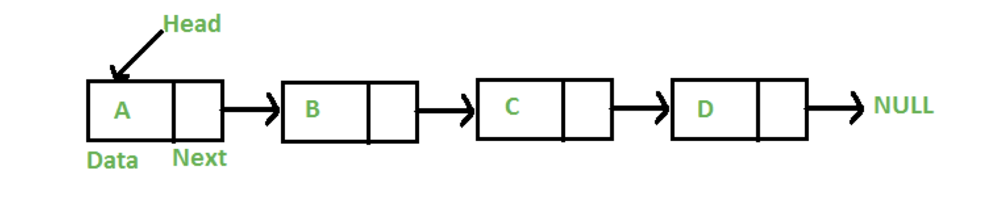
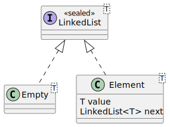

== Pattern Matching in Java

Es gibt zwei Beispiele:
* Implementierung einer LinkedList mit Pattern Matching
* Implementierung eines Telefontarif-Rechners mit Patter Matching

=== Technik-Check
. Starte im Root-Verzeichnis des Projekts ggf. Maven. Wir verwenden ein Maven Multi-Project-Build. Jedes Unterverzeichnis entspricht einem Kapitel im Workshop.
+
.Maven-Build
[source,shell]
----
> mvn clean package
----

. Führe die Klasse "TechnikCheck.java" unter 01-Pattern-Matching/src/main/java/hello/java21/ aus.

.Ausgabe Technik-Check
[source,shell]
----
Java 21 rocks!
----

=== Aufgabe 1: LinkedList in Java implementieren

Implementierung einer LinkedList mit algebraischen Datentypen in Java. Inspiriert durch https://github.com/MBoegers/TreeExperiments/tree/main/SingleLinkedListJFP/src/main/java/io/github/mboegers/list/jfp[LinkedList-Beispiel] von https://github.com/MBoegers[Merlin Bögershausen].

Die LinkedList ist einmal objektorientiert (Package `pattern.matching.list.oo`) und einmal funktional (Package `pattern.matching.list.fp`) implementiert.

In der funktionalen Variante bauen wir einen algebraischen Datentyp.

. Schaut Euch zunächst die objektorientierte Implementierung an? Wie funktioniert Sie? Führt den Test auf:

`src/test/java/pattern/matching/list/oo/LinkedListTest.java`

Beim funktionalen Beispiel ist der Datentyp ebenfalls bereits im implementiert: `src/main/java/pattern/matching/list/fp/LinkedList.java`.

. Schaut Euch die Funktionsweise des algebraischen Datentyps LinkedList an.

. Programmiert die bereits vorhandenen Funktionen `head`, `tail` und `contains` aus. Verwendet dafür switch-Expessions, Type-, Record- und Unnamed Patterns.

=== Aufgabe 2: Beispiel für einen fachlichen Usecase BadTelefon

Es gibt mehrere Packages mit unterschiedlichen Varianten.

==== Package `pattern.matching.badtelefon.v0`

* Ausgangsbeispiel
* einfacher Telefontarif-Rechner
* Logik nur in der Klasse Kunde, viele Code-Smells
* Pseudo-Enumeration mit Integer-Konstanten in Tarif
* keine wirkliche Domänenstruktur, Berechnungslogik komplett außerhalb

==== Package `pattern.matching.badtelefon.v1`

* ein Refactoring von v0: objektorientierter Lösungsansatz
* eigene Domänentypen für die Tarifarten
* Geschäftslogik in Domänenklassen (Strategie-Muster)
* Einsatz der Schablonenmethode zur Vermeidung von Redundanzen

==== Package `pattern.matching.badtelefon.v2`

* Lösungsansatz mit dem **Visitor-Pattern**
* bisheriger Ansatz in OOP, wenn man die Klassen selbst nicht ändern konnte und/oder wenn man parallel alternative Algorithmen (
zweiter Visitor) umsetzen muss
* Achtung: hier haben wir eine Art generischer Visitor statt überladene visit-Methode, wie beim GoF-Buch beschrieben

==== Package `pattern.matching.badtelefon.v3`

* Umbau zu Pattern Matching, Records, Sealed Interface, ...

==== Lösungsschritte

Wir könnten von verschiedenen Stellen (v0, v1 oder v2) beginnen. Hier starten wir in v3 in einer Ausgangssituation, die von v1 abgeleitet ist und geringfügig angepasst wurde.

1. Wir bauen zunächst `Tarif` in ein Sealed Interface um. Die Klassen `PrivatTarf`, `BusinessTarf` und `ProfiTarif` wandeln wir in Records um.
2. In der Klasse `Kunde` bauen wir in der `account()`-Methode zunächst die boolschen Ausdrücke in den ifs und ifs/elses um in Pattern Matching for instanceof (Type Pattern).
2. Anschließend wandeln wir das if/else in ein klassiches switch-Statement um. Hier könnte man das automatische Refactoring (Quick Fix) in IntelliJ oder Eclipse verwenden. Wir wollen am Ende auf jeden Fall eine switch-Expression (`gebuehr += switch(..)`) mit der Arrow-Syntax verwenden.
3. Umbau des Switches in switch-Expression mit Arrow-Syntax (kompakter) und yield statt break (bei mehrzeiligen case-Blöcken) und und Zuweisung des Switch-Resultats (gebuehr += switch(..))
4. Der letzten `else`-Zweig wird zum `default`-Branch und den können wir dann weglassen (Exhaustiveness-Prüfung dank Sealed Classes)
5. Umwandeln der Immutable-Klasse Zeitpunkt (auch eine Art Value Object) in ein Record (Quick-Fix/Refactoring in der IDE nutzen), Löschen von equals/hashCode und den gettern

.Klasse HelloJava
[source,java]
----
package jupdate.modules;

public class HelloJava11 {
    public static void main(String[] args) {
        System.out.println("Hello Java 11");
    }
}
----

